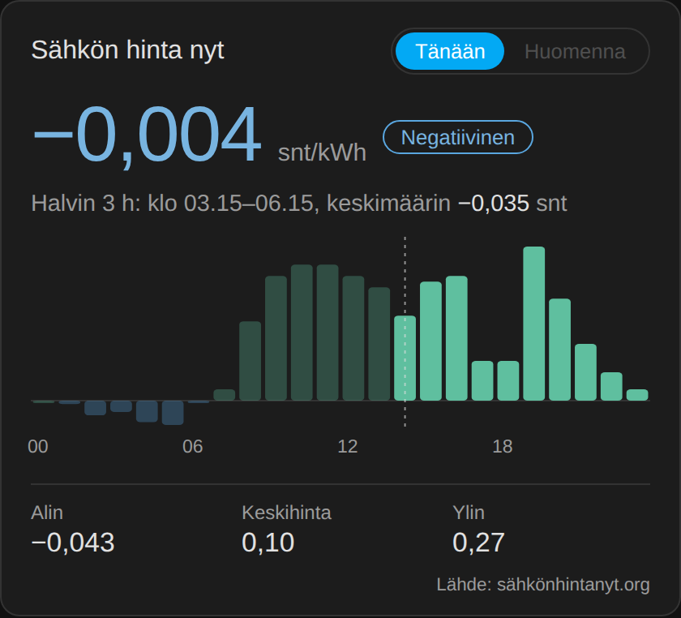

# ⚡ Sähkön hinta nyt – Home Assistant

Finnish spot electricity price (pörssisähkö) in Home Assistant: current price,
cheapest hours, tomorrow's prices and ready-made automations.
No custom integration, no API key, no registration.

Data: **[Sähkön hinta nyt – sähkönhintanyt.org](https://sähkönhintanyt.org/)**
(ENTSO-E / Nord Pool day-ahead, 15-minute resolution, VAT 25.5 % included).

🇫🇮 [Suomeksi alempana](#suomeksi)

## What you get

| Entity | What it does |
|---|---|
| `sensor.sahkon_hinta_nyt` | Current price in snt/kWh, with today's and tomorrow's prices as attributes |
| `binary_sensor.sahko_halpaa` | `on` during the 4 cheapest hours of the day |

Plus two blueprints:

- **Cheapest hours → turn on device** – water heater, EV charger, floor heating
- **Price alert** – phone notification when the price goes below or above your limit

## Installation

### 1. Add the sensors

#### Option A: HACS (recommended, no YAML)

[](https://my.home-assistant.io/redirect/hacs_repository/?owner=sahkonhintanyt-ha&repository=sahkon-hinta-nyt-ha&category=integration)

1. Click the button above, or in HACS open ⋮ → **Custom repositories**, add
   `https://github.com/sahkonhintanyt-ha/sahkon-hinta-nyt-ha` with type **Integration**.
2. Download **Sähkön hinta nyt** and restart Home Assistant.
3. Add the integration:

[](https://my.home-assistant.io/redirect/config_flow_start/?domain=sahkon_hinta_nyt)

   or Settings → Devices & services → **Add integration** → "Sähkön hinta nyt".
   Choose how many cheap hours per day you want (default 4). You can change it
   later from the integration's **Configure** button.

#### Option B: YAML package

In `configuration.yaml`, enable packages (if you haven't already):

```yaml
homeassistant:
  packages: !include_dir_named packages
```

Copy [`packages/sahkon_hinta_nyt.yaml`](packages/sahkon_hinta_nyt.yaml) into
your `config/packages/` folder and restart Home Assistant.
Want a different number of cheap hours? Change `hours=4` in the URL.

Use **either** A or B, not both – they create the same entities.

### 2. Import the blueprints

[](https://my.home-assistant.io/redirect/blueprint_import/?blueprint_url=https%3A%2F%2Fgithub.com%2Fsahkonhintanyt-ha%2Fsahkon-hinta-nyt-ha%2Fblob%2Fmain%2Fblueprints%2Fautomation%2Fsahkon-hinta-nyt%2Fcheap_hours_switch.yaml)
Cheapest hours → turn on device

[](https://my.home-assistant.io/redirect/blueprint_import/?blueprint_url=https%3A%2F%2Fgithub.com%2Fsahkonhintanyt-ha%2Fsahkon-hinta-nyt-ha%2Fblob%2Fmain%2Fblueprints%2Fautomation%2Fsahkon-hinta-nyt%2Fprice_alert.yaml)
Price alert

### 3. Optional: price card



A ready-made Lovelace card: current price, price level, today's and tomorrow's
prices as a bar chart (negative prices hang below the zero line), cheapest
3-hour window, and lowest / average / highest price.

Right from the card (admin users) you can also:

- **Ilmoitus** – create a price alert (below / above a limit, or when tomorrow's
  prices are published) to your phone or Home Assistant notifications
- **Ohjaus** – run a device or a scene during the cheapest hours, or whenever the
  price is below your limit
- **Scene** – save the current state of chosen devices as a scene

Everything the card creates is a normal Home Assistant automation or scene
(marked with ⚡), so you can edit it later in Settings. The card lists them and
lets you switch them on/off or delete them.

**Easiest:** install the card from HACS – see
[sahkon-hinta-card](https://github.com/sahkonhintanyt-ha/sahkon-hinta-card).

Manual install:

1. Download [`dist/sahkon-hinta-card.js`](dist/sahkon-hinta-card.js) and copy it to
   `config/www/sahkon-hinta-card.js`.
2. Settings → Dashboards → ⋮ → **Resources** → **Add resource**:
   URL `/local/sahkon-hinta-card.js`, type **JavaScript module**.
   (Resources is visible when *Advanced mode* is on in your user profile.)
3. Refresh the browser, then add the card:

```yaml
type: custom:sahkon-hinta-card
entity: sensor.sahkon_hinta_nyt
# optional:
# name: Sähkön hinta nyt
# thresholds: [5, 10, 15]   # cheap / normal / expensive limits in snt/kWh
# show_source: true
# time_zone: Europe/Helsinki # times are shown in Finnish time by default
# show_actions: true        # alert / control / scene buttons
```

### 4. Optional: ApexCharts chart

Needs [apexcharts-card](https://github.com/RomRider/apexcharts-card) from HACS.

```yaml
type: custom:apexcharts-card
header:
  show: true
  title: Sähkön hinta
graph_span: 2d
span:
  start: day
now:
  show: true
series:
  - entity: sensor.sahkon_hinta_nyt
    type: column
    data_generator: |
      return [...entity.attributes.raw_today, ...entity.attributes.raw_tomorrow]
        .map((p) => [new Date(p.start).getTime(), p.value]);
```

## API

Free, no key, CORS enabled. Base URL: `https://api.sähkönhintanyt.org`

| Endpoint | Returns |
|---|---|
| `/v1/now?zone=FI` | Current price (JSON) |
| `/v1/now.txt?zone=FI` | Current price (plain number) |
| `/v1/is-cheap?zone=FI&hours=4` | Is it cheap now? |
| `/v1/cheapest?zone=FI&hours=3` | Cheapest 3-hour window |
| `/v1/prices?zone=FI&day=today` | Today's 15-minute prices |
| `/v1/ha?zone=FI` | Home Assistant format |

Full documentation: [sähkönhintanyt.org/integraatiot/home-assistant](https://sähkönhintanyt.org/integraatiot/home-assistant/)

If you show the prices publicly, please credit the source with a link to
[sähkönhintanyt.org](https://sähkönhintanyt.org/).

---

## Suomeksi

Pörssisähkön hinta Home Assistantiin: hinta nyt, päivän halvimmat tunnit,
huomisen hinnat ja valmiit automaatiot. Ei lisäosia, ei API-avainta.

1. Helpoin tapa: lisää tämä repositorio HACSiin (Custom repositories, tyyppi
   **Integration**), lataa **Sähkön hinta nyt**, käynnistä Home Assistant
   uudelleen ja lisää integraatio: Asetukset → Laitteet ja palvelut → Lisää integraatio.
   Vaihtoehtoisesti voit käyttää YAML-pakettia (ks. yllä).
2. Käynnistä Home Assistant uudelleen.
3. Tuo blueprintit yllä olevilla painikkeilla.
4. Halutessasi lisää hintakortti: kopioi `dist/sahkon-hinta-card.js` kansioon `config/www/`, lisää resurssi `/local/sahkon-hinta-card.js` (JavaScript-moduuli) ja käytä korttia `type: custom:sahkon-hinta-card`.

Uudet anturit: `sensor.sahkon_hinta_nyt` ja `binary_sensor.sahko_halpaa`
(päällä vuorokauden neljänä halvimpana tuntina).

Tarkempi ohje ja vastaukset yleisiin kysymyksiin:
**[Sähkön hinta nyt – Home Assistant -ohje](https://sähkönhintanyt.org/integraatiot/home-assistant/)**

## License

MIT
